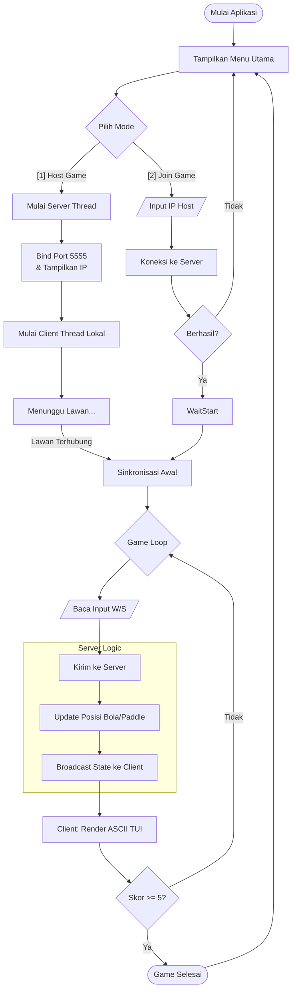
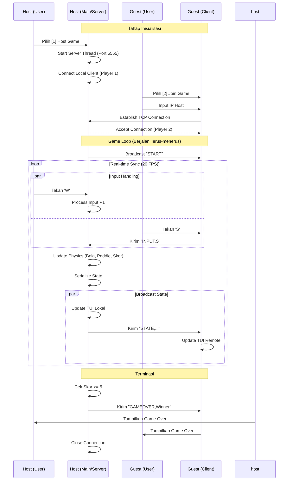

# Terminal Pong - Game Multiplayer CLI

Sebuah permainan Pong multiplayer waktu nyata (real-time) yang berjalan sepenuhnya di terminal menggunakan grafis ASCII. Proyek ini mendemonstrasikan konsep pemrograman jaringan menggunakan pustaka standar Python, menerapkan arsitektur Host-Client melalui soket TCP.

## Fitur

- **Multiplayer Real-time**: Dua pemain dapat bermain melawan satu sama lain melalui Jaringan Area Lokal (LAN).
- **Antarmuka CLI**: Menggunakan karakter ASCII untuk merender papan permainan, pemukul (paddle), dan bola.
- **Lintas Platform**: Berjalan di sistem Linux dan Windows dengan penanganan input spesifik platform.
- **Tanpa Ketergantungan Eksternal**: Dibangun hanya menggunakan pustaka standar Python (socket, threading, dll.). Tidak memerlukan instalasi paket pip tambahan.

## Persyaratan

- Python 3.6 atau lebih baru
- Jendela terminal atau command prompt
- Koneksi jaringan (Wi-Fi/LAN) untuk mode multiplayer

## Cara Bermain

### 1. Memulai Host (Pemain 1)

Host bertindak sebagai server permainan sekaligus pemain pertama (pemukul kiri).

1. Buka terminal.
2. Jalankan permainan:
   ```bash
   python3 main.py
   ```
3. Pilih opsi **[1] Host Game**.
4. Server akan mulai dan menampilkan Alamat IP Anda (contoh: 192.168.1.10). Bagikan IP ini kepada Pemain 2.
5. Permainan akan menunggu pemain kedua terhubung.

### 2. Bergabung ke Permainan (Pemain 2)

Pemain kedua terhubung ke host untuk bermain sebagai pemukul kanan.

1. Buka terminal di perangkat kedua (atau jendela terpisah di mesin yang sama).
2. Jalankan permainan:
   ```bash
   python3 main.py
   ```
3. Pilih opsi **[2] Join Game**.
4. Masukkan **Alamat IP Host** yang ditampilkan di layar host.
5. Setelah terhubung, permainan akan dimulai secara otomatis.

### Kontrol

- **W**: Gerakkan Pemukul Ke Atas
- **S**: Gerakkan Pemukul Ke Bawah
- **Q**: Keluar Permainan

### Aturan

- Bola bergerak secara otomatis.
- Pukul bola dengan pemukul Anda untuk memantulkannya kembali.
- Jika bola melewati pemukul Anda, lawan mencetak poin.
- Pemain pertama yang mencapai **5 poin** memenangkan permainan.

## Arsitektur Teknis

Aplikasi ini menggunakan arsitektur berkas tunggal (`main.py`) yang mengintegrasikan logika Server dan Client.

- **Komunikasi**: Soket TCP (Port 5555).
- **Konkurensi**: Threading digunakan untuk menangani komunikasi jaringan (kirim/terima), fisika permainan, dan input pengguna secara simultan tanpa pemblokiran.
- **Protokol**: Protokol berbasis string sederhana digunakan untuk sinkronisasi status (format CSV).
  - Client mengirim input: `INPUT,W` atau `INPUT,S`
  - Server menyiarkan status: `STATE,ball_x,ball_y,paddle1,paddle2,score1,score2`

## Diagram Alur (Flowchart)



## Diagram Urutan (Sequence Diagram)



## Penulis

Proyek Tugas Besar Network Programming
Dibuat menggunakan Python Standard Library.
